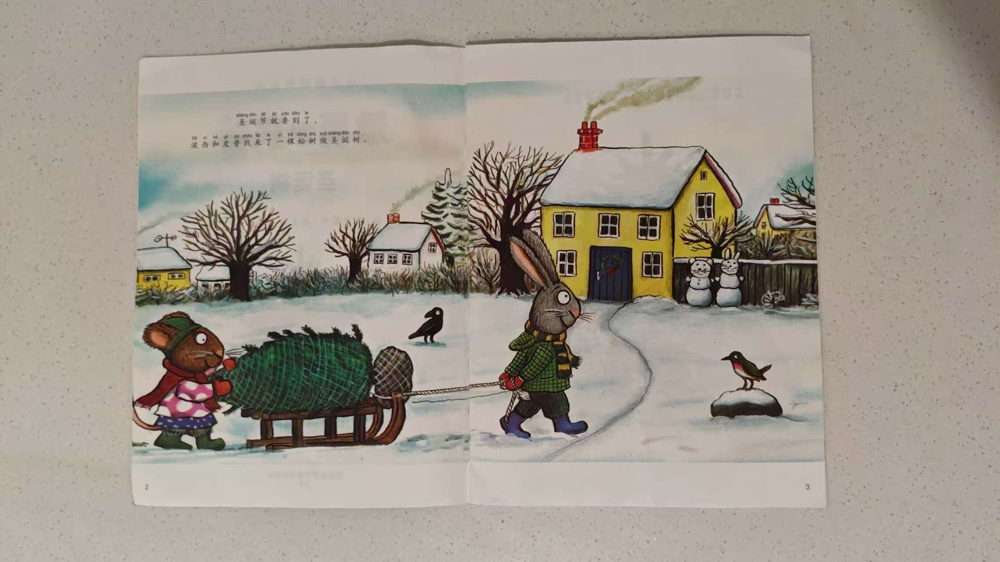
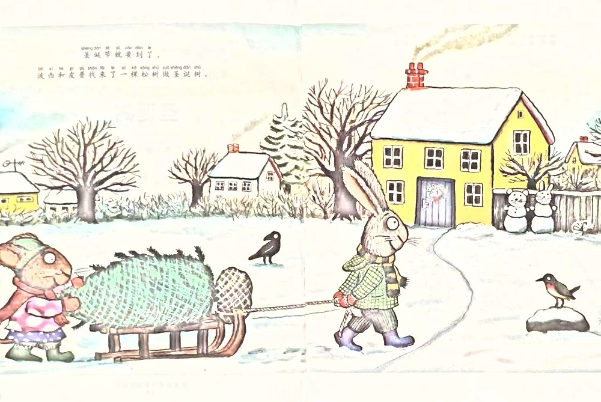
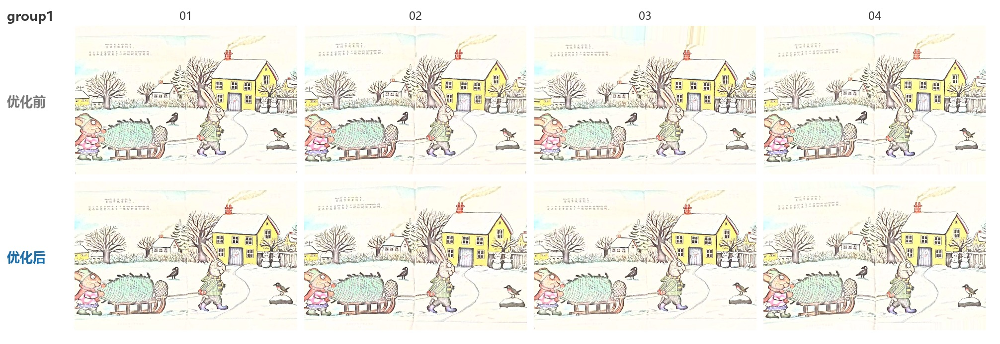
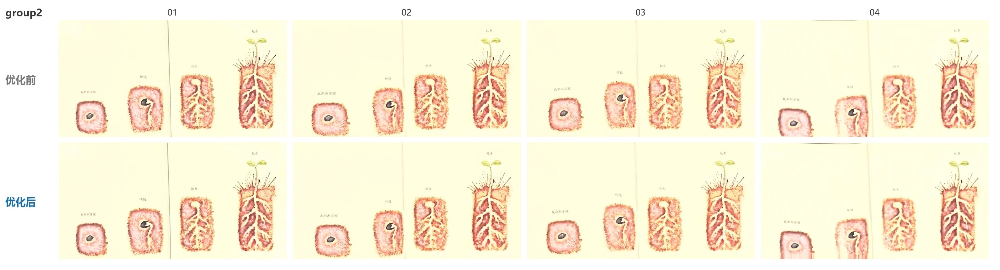
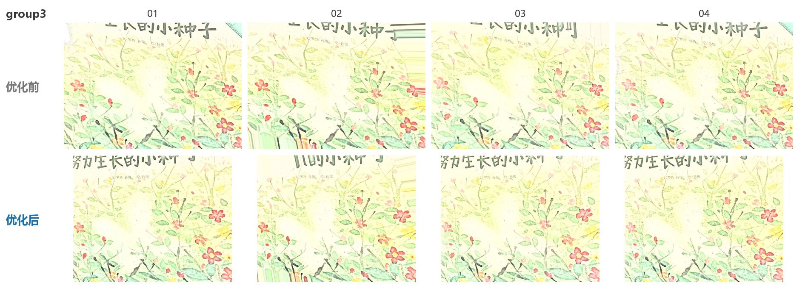

# book_flatten — 书页纠偏展平

给定一张拍书的照片，自动检测其中的书页，将其透视校正为正视图矩形，并做阴影归一化与组内对齐，输出一张干净、清晰、可直接阅读的矩形书页图。

- **输入**：单张照片（JPG / PNG，≤ 1600×1200 像素）。
- **输出**：校正后的图片字节（格式与输入一致），整张即书页，无背景。

## 特性

- **书页检测**：GrabCut 前景分割 + 凸包最大内接四边形定位书页边界；边缘检测（Canny）作为兜底。
- **组内对齐**：ORB 特征 + RANSAC 单应性对齐，保证同一本书不同角度拍出的结果高度一致。
- **阴影归一化**：低频光照场除法 + LAB 亮度校正，消除书页曲面阴影。
- **可复现**：`cv2.setRNGSeed(0)` 固定 GrabCut 内部随机序列，结果跨进程一致。

## 目录结构

```
.
├── book_flatten/
│   ├── __init__.py        # 导出 correct_paper / PageNotFoundError
│   ├── correct_paper.py   # 核心实现
│   └── requirements.txt   # numpy, opencv-python, Pillow
├── docs/                  # README 配图（效果展示、优化对比）
├── demo.py                # 最小调用示例
└── README.md
```

> 评测用的 `main.py` / `config.py` / `image_hash.py` / `input/` 不属于本包，仅用于本地基准测试，详见文末「复现评测」。

## 环境要求

- Python 3.12
- 依赖见 `book_flatten/requirements.txt`

## 安装

```bash
pip install -r book_flatten/requirements.txt
```

## 调用方式

同步接口（按赛题要求）：

```python
from book_flatten import correct_paper, PageNotFoundError

with open("photo.jpg", "rb") as f:
    image_bytes = f.read()

try:
    corrected_bytes = correct_paper(image_bytes)
except PageNotFoundError:
    # 照片中未检测到书页
    ...

with open("corrected.jpg", "wb") as f:
    f.write(corrected_bytes)
```

最小示例见 `demo.py`：

```bash
python demo.py 输入.jpg 输出.jpg
```

**异常处理**：检测不到书页时抛出 `PageNotFoundError`（继承自 `ValueError`）。

> 赛题同时允许异步形式 `async def correct_paper(image_bytes) -> bytes`，本实现提供同步版本，需要异步时可在调用处用 `asyncio.to_thread` 包裹。

## 效果展示

| 原图（拍摄角度倾斜、带桌面背景） | 展平后（矩形书页、无背景、阴影已归一化） |
| --- | --- |
|  |  |

---

## 优化前后对比

本版本相对上一版做了速度优化，整体耗时下降约 **28%**，一致性仅轻微放宽，三组仍全部处于 **CHALLENGE** 级别，肉眼观感基本一致。

### 速度对比（5 次运行平均，单位：秒）

| 组别 | 优化前 | 优化后 | 变化 |
| --- | --- | --- | --- |
| group1（简单） | 0.558 | 0.404 | −27.6% |
| group2（微隆起） | 0.294 | 0.208 | −29.3% |
| group3（边缘不全） | 0.354 | 0.258 | −27.1% |
| **整体** | **0.402** | **0.290** | **−27.9%** |

> 优化后第 4 次运行机器负载偏高（group1 0.57s、group2 0.29s、group3 0.36s，与优化前同量级），剔除该次后整体为 **0.261s**，降幅约 **−35%**。耗时对机器负载敏感，多次取样更能反映真实水平。

优化后 5 次运行的分组平均（秒）：

| 运行 | group1 | group2 | group3 |
| --- | --- | --- | --- |
| 1 | 0.38 | 0.17 | 0.24 |
| 2 | 0.37 | 0.17 | 0.20 |
| 3 | 0.33 | 0.21 | 0.23 |
| 4 | 0.57 | 0.29 | 0.36 |
| 5 | 0.37 | 0.20 | 0.26 |

### 一致性对比（同组两两 aHash 最大汉明距离，单位：字节，越小越一致）

| 组别 | 优化前 | 优化后 | 判定 |
| --- | --- | --- | --- |
| group1 | 9 | 14 | 均 ≤ 20.48 → CHALLENGE |
| group2 | 16 | 17 | 均 ≤ 20.48 → CHALLENGE |
| group3 | 20 | 20 | 均 ≤ 20.48 → CHALLENGE |

优化后一致性略有放宽（group1 最大距离 9 → 14），但全部仍低于 CHALLENGE 阈值 20.48，与「质量差不太多」的主观感受一致。

### 效果一一对比

同一张输入照片，上排为优化前结果、下排为优化后结果（列内为同一张图）：

**group1（简单）**



**group2（书页微微隆起）**



**group3（书页边缘略有不全）**



### 优化内容（代码层面）

| # | 改动 | 说明 | 影响 |
| --- | --- | --- | --- |
| 1 | `DETECTION_MAX_DIM` 450 → 289 | 书页检测（GrabCut / Canny）在更小的图上进行，像素量降到约 41% | **主要提速来源**；边界定位略变粗，是一致性轻微放宽的原因 |
| 2 | 阴影归一化改用 `_illumination_field` | 光照场由「原尺度大核高斯（sigma=7，核≈43×43）」改为「1/4 尺度估计 + 上采样」，高斯工作量降到约 1/16 甚至更低 | 第二个大幅提速点，输出观感几乎不变 |
| 3 | `ALIGNMENT_FEATURES` 900 → 600 | ORB 特征数减少，匹配更快 | 小幅提速，对齐稳健性略降 |
| 4 | 新增 `cv2.setRNGSeed(0)` | 固定 GrabCut 内部 k-means 的随机序列 | 不提速，但保证多次运行结果可复现、便于对比 |

### 结论

- **提速**：三组整体平均耗时 0.402s → 0.290s（约 −28%），主要来自「检测降采样」与「光照场降尺度」两处。
- **质量**：一致性指标略有放宽但仍全部满足 CHALLENGE（≤ 20.48 字节），对比图观感基本无差别。
- **取舍**：若要更稳的 group3，可把 `DETECTION_MAX_DIM` 调回 320 或把 `ALIGNMENT_FEATURES` 调大，代价是耗时上升。

---

## 运行耗时

在测试集（3 组 × 4 张）上单进程实测：

| 组别 | 平均耗时（优化后，秒） |
| --- | --- |
| group1（简单） | 0.40 |
| group2（微隆起） | 0.21 |
| group3（边缘不全） | 0.26 |

说明：

- 耗时与 CPU、机器负载强相关。首张图（进程内第一次调用）包含 OpenCV / ORB / GrabCut 的首次惰性初始化，是最慢的一次。
- 在作者本机（满足赛题「单核 CPU」要求）上，三组平均耗时均 ≤ 0.4 秒、单次最大 < 1 秒，满足赛题「均摊 ≤ 0.4s、单次 ≤ 1s」的目标。

## 一致性评测（aHash 汉明距离）

用 256 位平均哈希（average hash）的汉明距离衡量同组 4 张图结果的一致性。阈值：**CHALLENGE = 20.48 字节**，**BASE = 38.4 字节**（距离越小越一致）。

| 组别 | 最大两两距离（字节） | 结论 |
| --- | --- | --- |
| group1（简单） | 14 | 全 CHALLENGE |
| group2（微隆起） | 17 | 全 CHALLENGE |
| group3（边缘不全） | 20 | 全 CHALLENGE |

所有 18 组两两比较的汉明距离均 ≤ 20（< 20.48），**三组全部达到 CHALLENGE 级别**。group3（边缘不全）为最紧的一组，距离已接近阈值。

## 可调参数

集中在 `book_flatten/correct_paper.py` 顶部常量：

| 参数 | 当前值 | 作用 |
| --- | --- | --- |
| `DETECTION_MAX_DIM` | 289 | 检测阶段降采样边长；越小越快但组三易出画，越大越准但更慢。甜点区约 289–320。 |
| `ALIGNMENT_FEATURES` | 600 | ORB 特征数；调大（如 1500）可提升组三一致性，略增耗时。 |
| `MAX_OUTPUT_SIDE` | 1000 | 输出图最长边上限（像素）。 |
| `SHADE_SIGMA` | 7 | 阴影归一化高斯模糊 sigma。 |
| `GRABCUT_BORDER_RATIO` | 0.05 | GrabCut 初始矩形留边比例；组三出画可降到 0.02–0.03。 |
| `MIN_AREA_RATIO` | 0.18 | 候选页面最小面积占比。 |
| `ALIGNMENT_MIN_MATCHES` / `ALIGNMENT_MIN_INLIERS` | 20 / 20 | 对齐匹配数 / RANSAC 内点下限。 |
| `ALIGNMENT_CACHE_SIZE` | 8 | 组内参考帧缓存数量。 |

**勿改动**：`cv2.setRNGSeed(0)`（保证可复现）、`_WARMUP_ENABLED = False`（开启会扰动 GrabCut 随机序列，使组三一致性变差）。

## 常见问题

**Q：为什么每次运行时间不一样？**
A：主要是机器负载与调度波动（例如优化后第 4 次运行明显偏慢）；同一进程内首张最慢（冷启动）。**结果与质量由 `setRNGSeed(0)` 固定，不随时间变化。**

**Q：为什么结果能复现？**
A：GrabCut 内部 k-means 使用 OpenCV 全局随机数，已用 `setRNGSeed(0)` 固定；同时关闭了会扰动随机序列的预热（`_WARMUP_ENABLED = False`）。

**Q：提速会不会掉质量？**
A：会有一点点。检测降采样让边界定位略变粗，长宽比/透视估计的精度小幅下降，因此 aHash 距离从 group1 的 9 放宽到 14；但仍在 CHALLENGE 阈值内，观感基本无差别。

**Q：能和评测脚本一起跑吗？**
A：可以。把本仓库的 `book_flatten/` 放到含 `main.py` / `config.py` / `image_hash.py` / `input/` 的目录中，运行 `python main.py` 即可复现上述耗时与一致性数据（需额外安装 `imagehash`）。

## 复现评测

评测脚本与测试用例不在本包内，可从原始任务仓库获取。将本包并入后运行：

```bash
pip install imagehash          # 评测需要
python main.py                 # 输出三组耗时与两两 aHash 距离
```

## 许可

未指定，默认保留所有权利。如需开源协议可自行添加 `LICENSE`。
